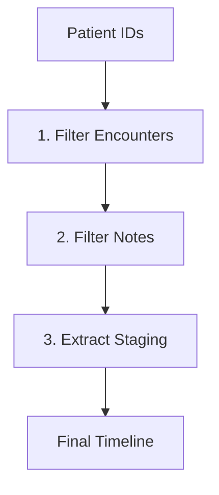

# Cancer Staging Timeline Pipeline (Modular Version)

A memory-efficient system for processing large-scale clinical data while extracting cancer staging timelines.


Step 1: patient_id_mapping.py


## Architecture



## Key Features
- **Chunked Processing**: Handles datasets larger than memory
- **Columnar Storage**: Uses Parquet with Snappy compression
- **Fault Tolerance**: Resume from intermediate steps
- **Privacy Preserving**: All processing stays local

## Setup

```bash
# Install core requirements
pip install pandas>=2.0 pyarrow>=14.0 dask[dataframe]>=2024.1.0

# For GPU-accelerated LLM processing
pip install torch>=2.2 transformers>=4.40
```

## Pipeline Execution

```bash
# Make pipeline executable
chmod +x run_pipeline.sh

# Run full pipeline (regex mode)
./run_pipeline.sh

# Run with LLM extraction
./run_pipeline.sh --use_llm
```

## Intermediate Data Structure

```text
temp/
├── filtered_encounters/  # Partitioned by patientdurablekey
│   └── patientdurablekey=*/ 
│       └── *.parquet
│
└── filtered_notes/  # Joined notes + encounters (Dask-based)
    └── *.parquet
```

## Output Format (final/staging_results.parquet)

Column | Type | Description
---|---|---
patientdurablekey | string | De-identified patient ID
note_date | timestamp | Date of clinical note
stage | string | Extracted staging info
system | string | Staging system (TNM/General)
confidence | float | Extraction confidence (0-1)
evidence | string | Relevant text snippet

## Usage Details

1. **Filtering Encounters**  
   Filters large encounter datasets based on a patient list to produce a reduced set of Parquet files, partitioned by `patientdurablekey`.

2. **Filtering Notes**  
   Uses Dask (`dask[dataframe]`) to merge note metadata and text with filtered encounters in a memory-efficient way.

3. **Extracting Staging**  
   Reads the filtered notes and applies the `StagingExtractor`. This can use simple regex rules or an LLM, depending on the `--use_llm` flag.

## Performance Benchmarks

Dataset Size | Mode | Memory Usage | Time
---|---|---|---
1TB | Regex | 8GB | ~2h
1TB | LLM (A100) | 24GB | ~8h
10TB | Regex | 8GB | ~20h

## Advanced Options

```bash
# Custom intermediate directories
./run_pipeline.sh \
  --temp_dir /mnt/bigdata/tmp \
  --output_dir /mnt/results
```

## Data Privacy
- Zero data egress - all processing local
- Intermediate files auto-deleted by default
- LLM models run entirely on-premises
