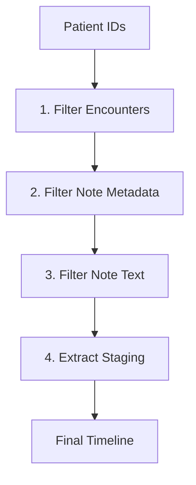

# Cancer Staging Timeline Pipeline (Modular Version)

A memory-efficient system for processing large-scale clinical data while extracting cancer staging timelines.

**Note**: The actual code for the extraction of features from clinical notes has been moved to another repository. This repository can be used for sequential SQL query from patientdurablekeys to note_texts in the data environment.

## Pipeline Overview

The pipeline consists of four main steps:
1. **Filter Encounters**: Extract relevant patient encounters
2. **Filter Note Metadata**: Get note metadata for filtered encounters
3. **Filter Note Text**: Extract note text for filtered metadata
4. **Extract Staging**: Process notes to extract cancer staging information, Can use RegEx or LLM-based derived from Metaprompting Development.

## Architecture



## Key Features
- **Chunked Processing**: Handles datasets larger than memory
- **Columnar Storage**: Uses Parquet with Snappy compression
- **Fault Tolerance**: Resume from intermediate steps
- **Privacy Preserving**: All processing stays local
- **LLM Integration**: Uses local Llama-3.1-8B model for staging extraction

## Setup

### Environment Setup

The pipeline requires a specific environment. You can use the pre-configured environment:

```bash
# Activate the pre-configured environment
source /wynton/protected/home/zack/brtan/Virtual_Environments/dask_distribution_env/bin/activate
```

### Required Packages

If you need to set up your own environment, install these packages:

```bash
# Install core requirements
pip install pandas>=2.0 pyarrow>=14.0 dask[dataframe]>=2024.1.0 duckdb>=0.9.0

# For GPU-accelerated LLM processing
pip install torch>=2.2 transformers>=4.40 accelerate>=0.26.0

# For progress tracking and logging
pip install tqdm>=4.66.0
```

## Detailed Pipeline Steps

### 1. Filter Encounters (`filter_encounters.py`)

Filters encounter records based on a list of patient IDs.

```bash
python filter_encounters.py \
  --patient_ids data/input/patient_ids_with_durablekey.csv \
  --input_dir /wynton/protected/project/ic/data/parquet/DEID_CDW/encounterfact \
  --output_dir data/output/filtered_encounters
```

**Parameters:**
- `--patient_ids`: Path to CSV file containing patient IDs (column: 'patientdurablekey')
- `--input_dir`: Directory containing input encounter Parquet files
- `--output_dir`: Directory where filtered encounters will be saved

**Output:**
- Partitioned Parquet files containing filtered encounters

### 2. Filter Note Metadata (`filter_notemetadata.py`)

Joins note metadata with filtered encounters to identify relevant clinical notes.

```bash
python filter_notemetadata.py \
  --encounters_dir data/output/filtered_encounters \
  --note_meta_dir /wynton/protected/project/ic/data/parquet/DEID_CDW/note_metadata \
  --output_dir data/output \
  --scratch_dir /scratch/username/temp_note_processing
```

**Parameters:**
- `--encounters_dir`: Path to filtered encounters (default: data/output/filtered_encounters)
- `--note_meta_dir`: Path to note metadata (default: /wynton/protected/project/ic/data/parquet/DEID_CDW/note_metadata)
- `--output_dir`: Path to save filtered metadata (default: /scratch/username/filtered_notes)
- `--scratch_dir`: Path for temporary files (default: /scratch/username/temp_note_processing)
- `--chunk_size`: Number of note keys to process in each batch (default: 50000)

**Output:**
- Chunked Parquet files containing filtered note metadata

### 3. Filter Note Text (`filter_notetext.py`)

Extracts note text for the filtered metadata.

```bash
python filter_notetext.py
```

**Configuration (edit in script):**
- `FILTERED_METADATA_DIR`: Directory containing filtered metadata (default: /scratch/username/filtered_notes/filtered_metadata)
- `NOTE_TEXT_DIR`: Directory containing note text (default: /wynton/protected/project/ic/data/parquet/DEID_CDW/note_text)
- `OUTPUT_DIR`: Directory to save filtered notes (default: data/output/filtered_notes)

**Output:**
- Batch Parquet files containing filtered notes with text

### 4. Extract Staging (`extract_staging.py` with `run_extraction.sh`)

Processes filtered notes to extract cancer staging information using a local LLM.

```bash
conda activate ehrshot_env

# Install accelerate
pip install accelerate>=0.26.0

# Run extraction on a specific batch
./run_extraction.sh 1

# Run tests to verify parsing logic
./run_extraction.sh --test

# Run benchmark to measure parsing performance
./run_extraction.sh --benchmark
```

To Do: You will want to filter by note_type first "Progress Notes, Imaging, Consults, Plan of Care, Lab, Interdisciplinary, H&P, Assessment & Plan Note, Pathology and Cytology, Discharge Summary, Operative Report, Significant Event" halving the notes


**Parameters for `run_extraction.sh`:**
- Batch number (integer): Process a specific batch of notes
- `--test`: Run parsing logic tests
- `--benchmark`: Run parsing performance benchmark
- `--help`: Display help message

**Output:**
- Parquet and CSV files containing extracted staging information

## Intermediate Data Structure

```text
data/output/
├── filtered_encounters/  # Partitioned by patientdurablekey
│   └── partition_key=*/ 
│       └── *.parquet
│
├── filtered_notes/       # Filtered notes with text
│   └── final/
│       └── filtered_notes_batch_*.parquet
│
└── staging_results/      # Extracted staging information
    ├── staging_results_batch_*.parquet
    └── staging_results_batch_*.csv
```

## Output Format (staging_results)

Column | Type | Description
---|---|---
patientdurablekey | string | De-identified patient ID
stage | string | Extracted staging info (e.g., "IIB" or "T2N1M0")
system | string | Staging system (TNM/General)
evidence | string | Relevant text snippet

## Performance Considerations

- **Memory Usage**: The pipeline is designed to process data in chunks to minimize memory usage
- **GPU Acceleration**: The staging extraction step uses GPU acceleration when available
- **Batch Processing**: Notes are processed in batches to improve throughput
- **Parsing Efficiency**: The parsing logic is optimized for speed (~1.3M parses/second)

## Troubleshooting

### Common Issues

1. **Missing Accelerate Package**
   
   Error: `Using low_cpu_mem_usage=True or a device_map requires Accelerate: pip install 'accelerate>=0.26.0'`
   
   Solution: Install the accelerate package
   ```bash
   pip install accelerate>=0.26.0
   ```

2. **CUDA/GPU Issues**
   
   If you encounter GPU-related errors, try setting specific CUDA devices:
   ```bash
   export CUDA_VISIBLE_DEVICES=0  # Use only the first GPU
   ```

3. **Memory Errors**
   
   For large files, you may need to adjust batch sizes in the scripts or increase your system's swap space.

## Data Privacy
- Zero data egress - all processing local
- Intermediate files stored in protected directories
- LLM models run entirely on-premises
