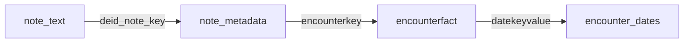

# Cancer Staging Extraction Pipeline

A system for extracting cancer staging information from clinical notes and linking to encounter dates.
Note: This is buily as an inhouse tool for hospital research systems and so only uses Local LLMs! At no point do we use a remote LLM.

## Pipeline Overview

1. **Staging Extraction** (`extract_staging.py`):
   - Processes clinical notes from Parquet files
   - Extracts first mention of cancer staging (Stage I-IV or TNM)
   - Identifies associated dates in YYYY-MM-DD format
   - Outputs structured Parquet files with staging data
   - Set use_llm = True to use LLM-based extraction for complex cases

2. **Encounter Mapping** (`map_encounter_dates.py`):
   - Maps notes to encounters using note metadata
   - Links encounters to dates from encounter facts
   - Creates unified mapping file
   - To Do: Map encounters to patients!

## Requirements

```bash
# Python 3.8+ required
pip install -r requirements.txt

# For LLM extraction (optional):
pip install transformers
```

## Usage

### 1. Extract Staging Information

```bash
python extract_staging.py \
  --input_dir /path/to/note_text_parquets \
  --output_dir ./staging_results \
  [--use_llm] \
  [--llm_model "gpt-4o"]
```

**Input:**
- Directory of note text Parquet files with columns:
  - `deid_note_key` (string)
  - `note_text` (string)

**Output:**
- Directory of Parquet files with columns:
  - `note_id` (deid_note_key)
  - `stage` (extracted staging text or null)
  - `date` (YYYY-MM-DD or null)

### 2. Create Encounter-Date Mapping

```bash
python map_encounter_dates.py \
  --note_metadata_dir /path/to/note_metadata \
  --encounterfact_dir /path/to/encounterfact \
  --output ./note_encounter_mapping.parquet
```

**Input:**
- Note metadata Parquets (columns: deid_note_key, encounterkey)
- Encounterfact Parquets (columns: encounterkey, datekeyvalue)

**Output:**
- Single Parquet file with:
  - `deid_note_key`
  - `encounterkey`
  - `datekeyvalue` (encounter date)

## Example Pipeline

1. Process clinical notes:
```bash
python extract_staging.py \
  --input_dir /data/note_text \
  --output_dir ./staging_data
```

2. Create encounter mapping:
```bash
python map_encounter_dates.py \
  --note_metadata_dir /data/note_metadata \
  --encounterfact_dir /data/encounterfact \
  --output ./mappings/note_encounter.parquet
```

3. Join staging data with encounter dates:
```python
import pandas as pd

staging_df = pd.read_parquet('./staging_data')
mapping_df = pd.read_parquet('./mappings/note_encounter.parquet')
final_df = staging_df.merge(
    mapping_df,
    left_on='note_id',
    right_on='deid_note_key',
    how='left'
)
```

## Data Model



## Performance Notes
- Processes Parquet files in parallel using pandas
- Each output file contains ~128MB of data (optimal for distributed processing)
- Regex-based extraction handles ~1000 notes/sec on modern hardware (We have a rough ballpark of ~250,000 notes to process)
- LLM extraction adds significant overhead (10-100x slower)
- For datasets >1TB, consider Spark/Dask for distributed execution
